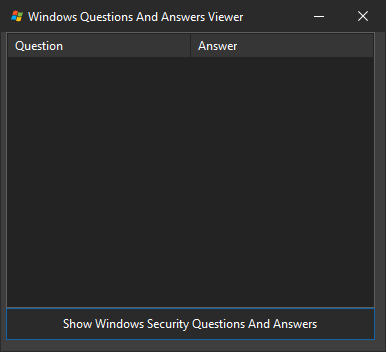

# 🔐 Windows Security Questions Recovery Tool
A specialized security research tool built in Delphi for extracting and analyzing Windows security questions. Provides advanced system-level access capabilities for security testing and analysis.

<p align="center">
  ⚠️ For Educational and Research Purposes Only
</p>

<p align="center">
  
</p>

## 🛡️ Core Features
- **Registry Analysis**: Extracts Hex Encoded security data from Windows registry
- **Automated Decryption**: Converts hex-encoded data to readable format 
- **SYSTEM Level Access**: Utilizes elevated privileges via service creation
- **Clean Operation**: Automatic cleanup of temporary files

## 🔧 Technical Implementation
- **Service Integration**: Custom Windows service for SYSTEM context execution
- **Security Checks**: Administrative privilege verification
- **Data Processing**: JSON parsing and hex decoding
- **UI Components**: ListView display with clipboard integration

## 📋 Requirements
```plaintext
- Windows OS
- Administrative Rights
- Delphi RAD Studio to compile and build the project!
```

## 🚀 Usage
1. Launch with administrative privileges (it has an admin check built into the code so you must run as admin in any case)
2. Click button at the bottom of the program to initiate extraction
3. View recovered Q&A pairs in list (they will show up on the listview component)
4. Copy items via the right click context menu

## 💻 Code Structure
```pascal
- Unit1.pas: Main application logic
  ├── Registry extraction
  ├── Data processing
  └── UI handling
  
- uSysAccount.pas: SYSTEM elevation
  ├── Service management
  ├── Process creation
  └── Security validation
```

## ⚠️ Security Note
For authorized security research only. Use responsibly and ethically.

## 👤 Author
- **Developer**: BitmasterXor
- **Contact**: Discord: bitmasterxor

## 📜 License
Research and educational use only. Provided FREE AS IS!

---
<p align="center">Made with ❤️ by: BitmasterXor, using Delphi RAD Studio</p>
